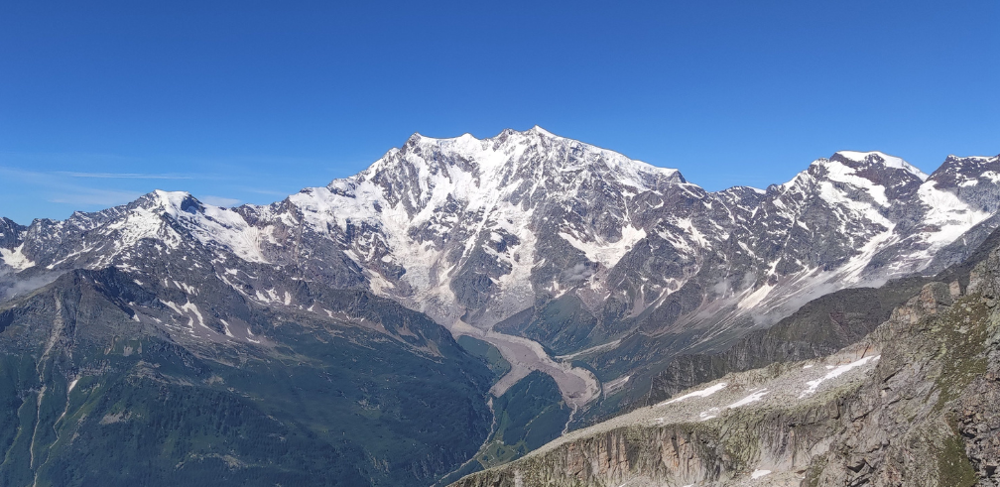

# TheBelvedereGlacier-Handbook
Handbook for exploring the belvedere glacier website.
This Handbook, hosted on Github Pages with MkDocs material template, is intended to be the practical guide for people interested in learning more about the **[Belvedere Glacier project](https://thebelvedereglacier.it/)** curated since 2015 by *[LabMGF](https://labmgf.dica.polimi.it/)* at the [Department of Civil and Environmental Engineering](https://www.dica.polimi.it/) of [Politecnico di Milano](https://www.polimi.it/).

In the online handbook available at this link https://labmgf-polimi.github.io/thebelvedereglacier-handbook/ you will have the opportunity to understand more about the project, while learning how to use smoothly the different interactive web-based tools developed in order to assist the virtual exploration of the 2D and 3D data collected and processed during the in-situ monitoring campaigns.

# Updating the documentation

Please install [mkdocs materials](https://squidfunk.github.io/mkdocs-material/) and contributes to the desired section and page.

## Commands

* `mkdocs new [dir-name]` - Create a new project.
* `mkdocs serve` - Start the live-reloading docs server.
* `mkdocs build` - Build the documentation site.
* `mkdocs -h` - Print help message and exit.
* `mkdocs gh-deploy --force` - Deploy your project documentation manually.

## Project layout

    mkdocs.yml    # The configuration file.
    docs/
        index.md  # The documentation homepage.
        ...       # Other markdown pages, images and other files.

# Contacts

* Project responsible and supervisor: Livio Pinto, Full Professor at DICA - PoliMi (livio.pinto@polimi.it)

* Reference person for Handbook docs: Federica Gaspari, PhD Student at DICA - PoliMi (federica.gaspari@polimi.it)
