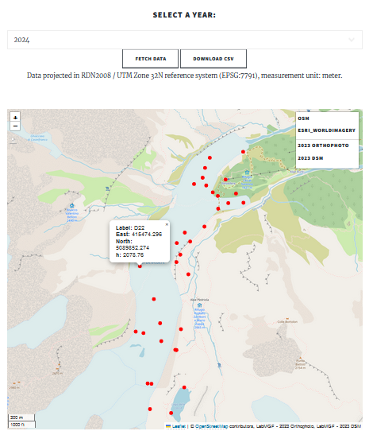
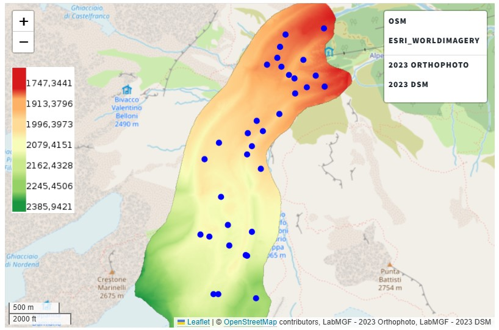
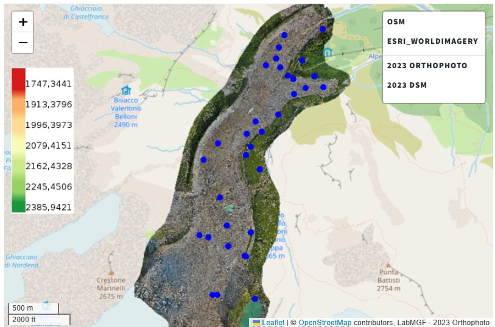
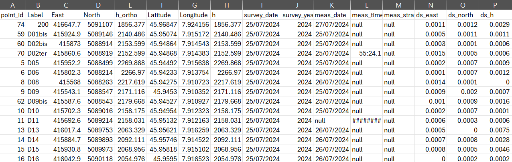

# 2D Map Explorer

The [**2D Map Explorer**](https://thebelvedereglacier.it/pages/web-map/index.html) is the web-based tool that allows every user, also without a technical background in geomatics, to virtually explore the web map of the glacier with data output from the historical in-situ monitoring campaign.
The tool is available online freely without the need to install any technical software locally. Hence, the velocity and quality of rendering exclusively rely on the internet connection.

The main functionalities of the web map consist in:
* Exploration of measured Ground Control Points (GCPs) by survey year (starting from 2015) and visualisation on the map.
* Download of GCPs measurements per year
* Web Mapping Services links and resources

## GCPs exploration

Clicking on the *Select a year* box, users can choose the preferred survey year. After, by clicking *Fetch data* button, that year measured GCPs will be loaded on the map as points along the glacier.
Clicking on one of them will make appear a pop up banner that includes its label and measured coordinates.

The web map also allows to load as basemap the most recent DSM or orthophoto basemap (connected as WMS). In order to activate them, users can simply click on the preferred resource name on the legend on the top-right of the map.

## Measurements download

After selecting a survey year to load on the map, users can also decide to export the GCPs measurements dataset for the given survey. This is possible by clicking the *Download CSV* button.
The download Comma-Separated-Value file will be a table that is an extract of the original measurement table in the Belvedere Glacier database.

## WMS Connection

The on-going process of publication of the Belvedere data is taking care also of the raster. Orthophotos and Digital Surface Models are already available to download in the dedicated Zenodo repository. However, there's an ongoing process of sharing the same rasters in a read-only mode as Web Map Services.

Currently orthophotos and DSMs are published on the laboratory GeoServer. In this way, by simply copying the resource URLs from the website, it is possible to visualise the raster of interest on other software that support WMS-connection, for example QGIS. At the moment, only 2023 rasters are made available but the project team is working on increasing server capacities for hosting more data.