# 3D Viewer

The 3D viewer is the web-based tool that allows every user, also without a technical background in geomatics, to explore pointcluds and target time series from the annual monitoring campaigns. The tool is available online freely without the need to install any technical software locally. Hence, the velocity and quality of rendering exclusively rely on the internet connection.

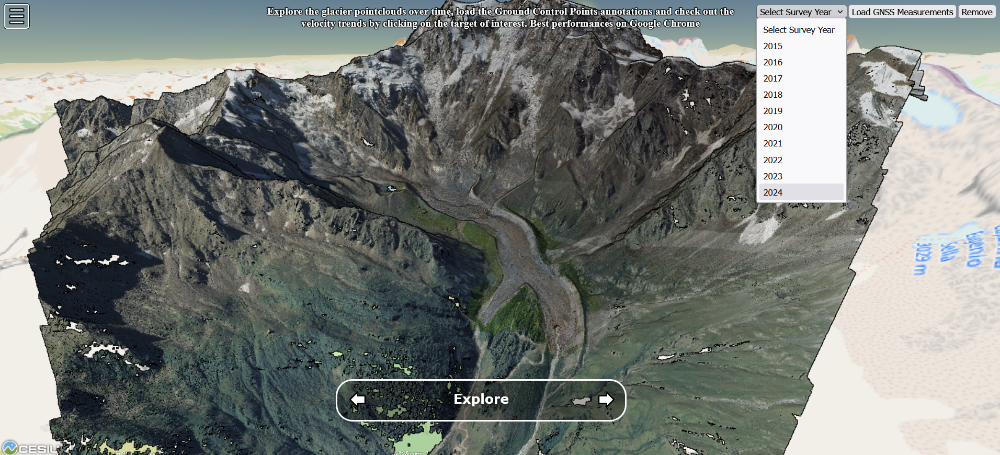

The platform, based on the combined adoption of [Potree](https://github.com/potree/potree), [Cesium](https://cesium.com/) and [Echarts](https://echarts.apache.org/en/index.html) JS libraries, not only deploy on the web pointclouds through WebGL technologies, but also enable the temporal exploration of them, integrating native Potree functionalities with custom features in support to user-friendly navigation.

For a better and stable experience, we highly recommend the usage of Google Chrome for best performances on the web.

## Basic functionalities

At first opening on the web browser, the viewer shows the main 3D Map exploration scene, the so-called *Potree-container*. The default 3D scene includes one OpenStreetMap basemap overlayed by two pointclouds: the first one used as background for the scene and referring to a larger portion of the scene and the second one referring to the glacier surface reconstructed during the most recent survey. You can navigate interactively in this space with your laptop mouse, using left click for rotating, right click for translating and wheel scrolling for zooming in or out of the scene. By double-clicking a certain point along the glacier, the viewpoint will be automtically zoomed in there. In this way you will have a qualitative idea of the glacier extension.

If you want to access native tools for extracting some basic information from the 3D scene, on the top left of the scene search for the button with the tre lines and click it. It changes the visibility of the lateral sidebar, where you can find **Tools** within the different sections.

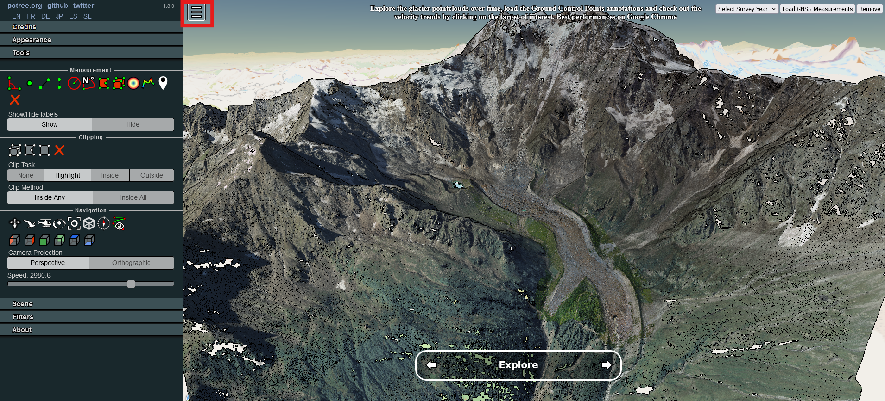

A detailed explanation of the different functionalities linked to each icon is presented on our [Potree documentation](https://potree-templates.readthedocs.io/en/latest/pages/getting-started.html). In this haandbook we will only focus on the usage of two of such tools:

* Measurements of distances

* Cross-section extraction

### Measurements of distances

This tool allows for measurement calculation by simply clicking at least two points on the scene. You can enable it by first clicking the *Distance measurement* icon in the **Tools** section as shown in the picture. Then, navigate through the 3D scene to identify the features whose distance you want to measure. For example, in the example the opening of the glacier terminal lobe niche.

Once you identified with the cursor the starting point of the measurement, left click it. Hence, left-click the newly appeared red point and drag it to the ending point of the desired measurement, then drop it. As the measuring line is defined, a label appers, containing the information about the distance in the unit linked to the reference system in which the pointcloud is referenced.

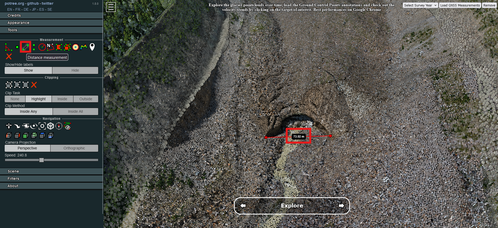

Every new measurement is saved as a new *measurement object* inside the Scene tree, accessible through the **Scene** section on the later sidebar. In the folder group named *Measurements*, you can find the newly created measurement together with its properties (coordinates of its vertex, distance). From here you can either delete the measurement or copy the coordinates.

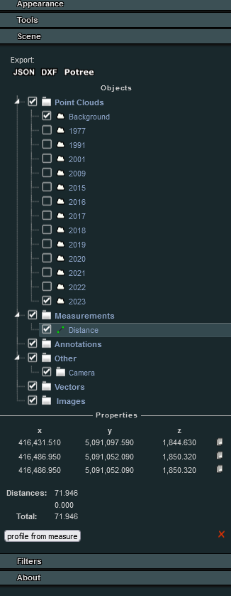

### Cross-section extraction

The basic functionalities of the Potree-based viewer also includes the possibility to easily extract cross-sections.
In this example we compare qualitatively the glacier surface from 1977 with the one of 2023.
To do so, go to the **Scene** section in the lateral sidebar and make sure that both 1977 and 2023 point clouds are checked so they are visible in the 3D scene.

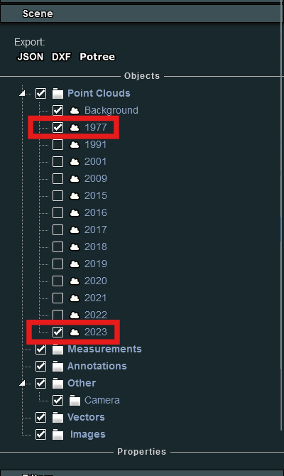

Once you checked that both clouds are activated, go to the **Tools** section and click the *Height profile* icon.
Hence, left click on the starting point of your desired profile.
Then, click again and drag it until the ending point and drop it.
Now you see a new red line in the scene: that indicates that you successfully created a cross-section object.

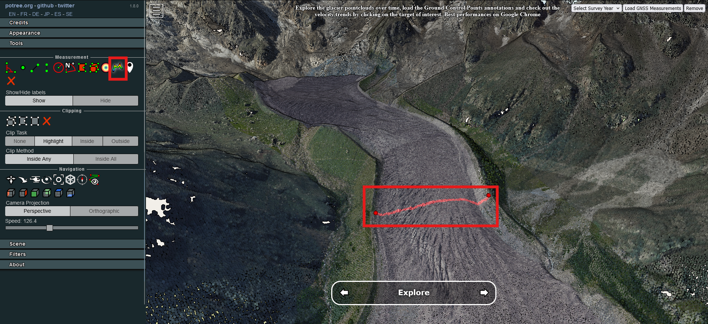

Similarly to the measurement function, each new section is saved as a new *Profile Object* within the scene tree, accessible from the *Scene* section of the later sidebar. In the folder group named *Measurements* you will find the newly created section along with its properties. 

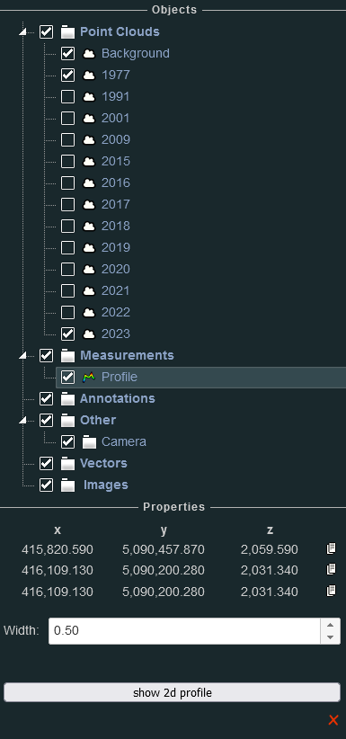

From here you can change the thickness of the section in the *Width* box: the greater the width, the greater the number of points from the point clouds that will be used for tracing the section. However, if the section is too large, the result may be inaccurate, making it difficult to understand the morphology of the site. Once y ou defined it, click the *show 2d profile* button. It opens a new window containing the 2D view of the extracted profile. From here you can evaluate both quantitatively and qualitatively how glacier heights changed over time.

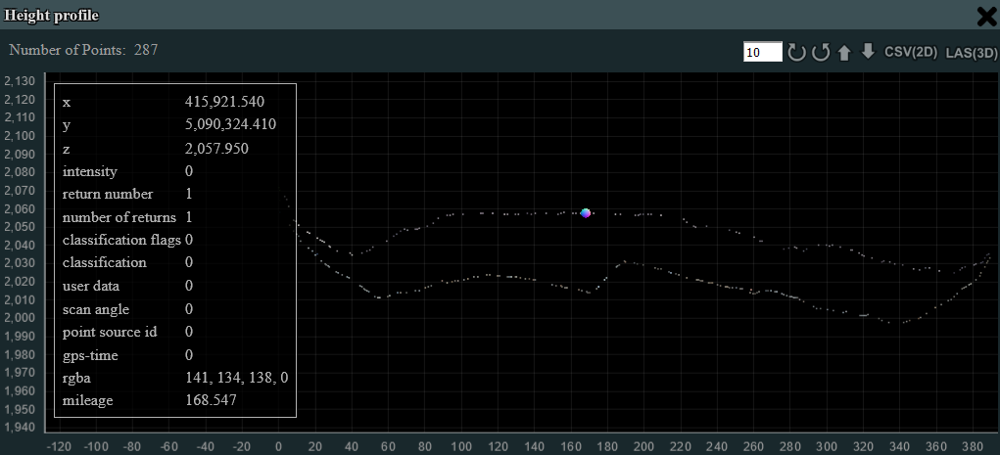

## Custom functionalities

In order to enhance user experience in the exploration of the scene, two additional features have been included in the GUI of the viewer, better supporting the temporal exploration of the data.
### Temporal exploration

The interface includes a timeline slider and a dropdown menu for selecting specific years. The dropdown, as shown in the first image, lists available years such as 1977, 1991, 2001, 2009, and several others up to 2023. Selecting a year loads the corresponding point cloud dataset, which represents the glacier’s surface geometry for that specific year.

At the bottom of the viewer, a year navigation bar displays the currently selected year. Users can navigate between years using the left and right arrows, making it easy to load and compare different point clouds.

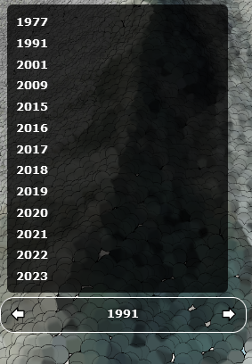

Once a specific year is selected, the 3D Viewer displays the glacier’s surface as a detailed point cloud model. In the second image, the 1991 point cloud is loaded, showing the terrain, glacier extents, and surrounding features with high accuracy. Each point in the cloud represents a 3D coordinate, capturing the elevation and shape of the glacier at the time of the survey.

Users can navigate the scene using interactive tools for zooming, panning, and rotating the view. This allows for a close inspection of surface features such as ice extents, debris-covered zones, and terrain roughness.

Switching between years allows users to observe how the glacier surface has evolved across decades. By comparing point cloud datasets from different years, it is possible to detect changes such as glacier retreat, surface lowering, and shifts in moraine deposits.

The 3D Viewer’s smooth transition between datasets facilitates visual comparisons, making it easier to identify areas of significant change.

### GCPs time series

This section explains how to use the 3D Viewer connected to a database to visualize annual glacier measurements and explore time series data for individual points.

At the top of the interface, there is a dropdown menu labeled “Select Survey Year.” Clicking on this menu reveals a list of available years, such as 2015 through 2024. Selecting a specific year will load the corresponding glacier measurement data into the viewer. This allows users to explore the glacier’s surface as it was surveyed during that year.

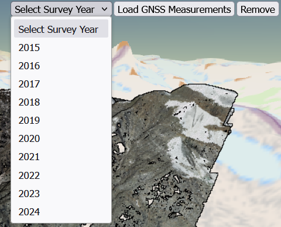

Next to the dropdown, a button labeled “Load GNSS Measurements” enables users to display measured points on the glacier. Once loaded, the points appear across the glacier surface within the 3D scene. Each point corresponds to a GNSS station or reference location where measurements have been collected annually.

Once the GNSS points are visible, clicking on any individual point in the 3D scene triggers an interactive information panel. The panel displays precise details, including the point’s geographic coordinates, the date of its first and most recent surveys, and other relevant data.

Additionally, a small graph appears alongside the point information, showing the time series of measurements, such as velocity changes over time. This graph visualizes trends for the selected point, helping users analyze variations in glacier motion or surface elevation across multiple years.

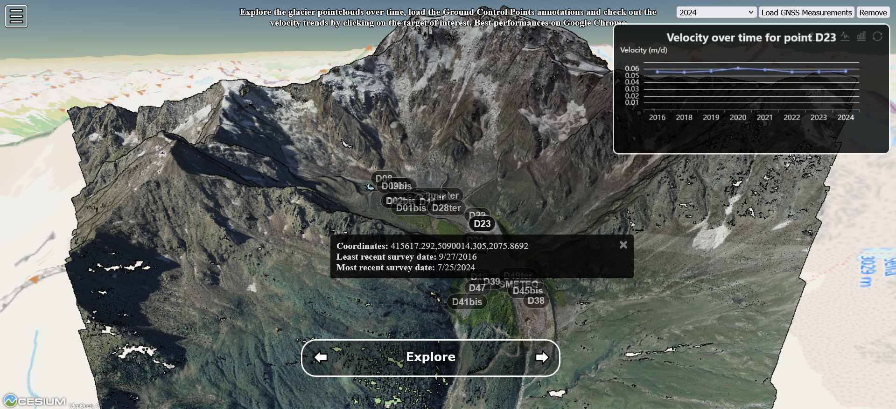

## Open source code

To enhance reproducibility in other research or climate change awareness contexts, the source code of the web viewer, as part of the code of the entire Belvedere website, is openly accessible and forkable for customisation in a dedicated [Github repository](https://github.com/Tars4815/thebelvedereglacier/tree/main/app/potree).

## Contacts

In case of suggestions or feedback on your experience with this tool, please open an issue on the Github repository or contact federica.gaspari@polimi.it.