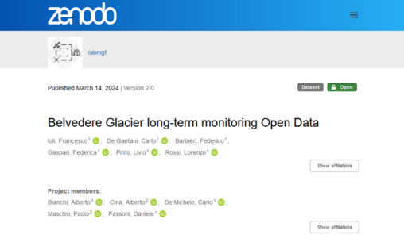
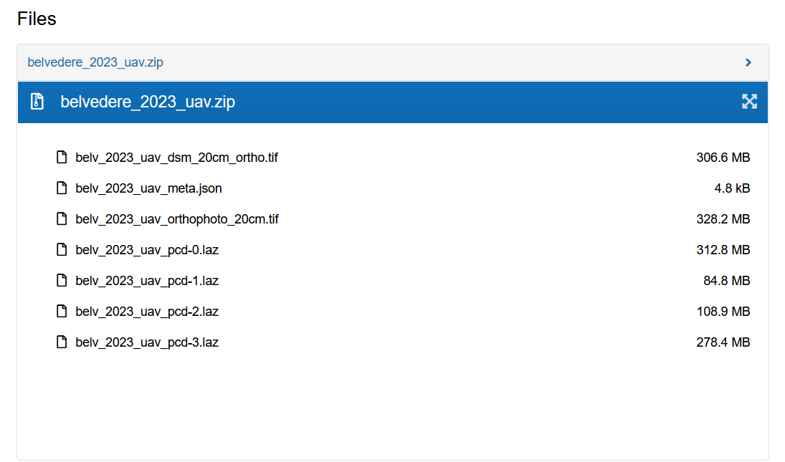

# Glacier Open Data

All results from the photogrammetric campaigns, including **point clouds**, **orthophotos**, and **DSMs**, are publicly available in a [Zenodo repository](https://zenodo.org/records/10817029). Would like to know more aboout these types of data? You can learn more about them and their nature on our [Learning Resources](learning-resources.md) from the Belvedere Summer School.

This rich dataset offers researchers a valuable base for further investigating diverse topics. Potential applications include the detailed analysis of geomorphological processes like moraine collapse in response to glacier thinning or as inputs for glacier modeling to project future glacier evolution under various climate scenarios. Data are currently released under Creative Commons Attribution 4.0 International licence.

While exploring the Zenodo repository, you will notice that data, currently ranging from 1977 to 2023, are downloaded in single packages year by year. You can access a preview of the content of each package by clicking the eye button.

All the files are named according to the following naming schema:

"belv_YYYY_surveyplatform_datatype[_resolution][vertical_datum][-tile_number].extension"

where: 

    - YYYY: is the year of the survey
    - surveyplatform: can be either "uav" for the UAV-based photogrammetry survey or "histo" for the historical aerial datasets.
    - datatype*: can be either "pcd" for point clouds, "orthophoto" for orthophotos and "dsm" for DSMs. 
    - resolution: on-ground resolution of each pixel in meters. This applies only to raster data (orthophoto and DSMs)
    - vertical_datum: if the DSM is given in orthometric coordinates, the label "ortho" is present in the filename, otherwise the height of the dataset is supposed to be ellipsoidal.
    - tile: tile number, if the data is tiled to avoid large files.

Additionally, a sample Python script is provided (*read_metadata.py*) in order to help read the metadata included in each package.

Once you identify your year of interest, you can proceed with the download of the data package.

The downloaded Digital Surface Models and Orthophotos can be easily imported in a GIS environment with QGIS as raster files from the menu *Layer > Add Layer > Add raster layer* and then simply select the preferred raster file to upload. You can also simply drag and drop it inside the Map Canvas.

Similarly, starting from QGIS 3.32, the downloaded pointclouds can be imported in a GIS environment with QGIS as raster files from the menu *Layer > Add Layer > Add pointcloud layer* and then select the preferred file to upload. You can also simply drag and drop it inside the Map Canvas.

If you want to learn more about how to use QGIS, please refer to our Summer School [Learning Resources](https://tars4815.github.io/belvedere-summer-school/module4/module4/) - Module 4 dedicated to GIS tools.

Traditionally, pointclouds can be analysed and processed in another free and open source software, such as [CloudCompare](https://www.danielgm.net/cc/). Also, in this case, you can simply drag and drop the laz file in the main window to start analysing it.

# Reference

If you use our dataset for your study or work, please consider citing the work as follows:

* Ioli, F., De Gaetani, C., Barbieri, F., Gaspari, F., Pinto, L., & Rossi, L. (2024). **Belvedere Glacier long-term monitoring Open Data** (2.0) [Data set]. Zenodo. https://doi.org/10.5281/zenodo.10817029