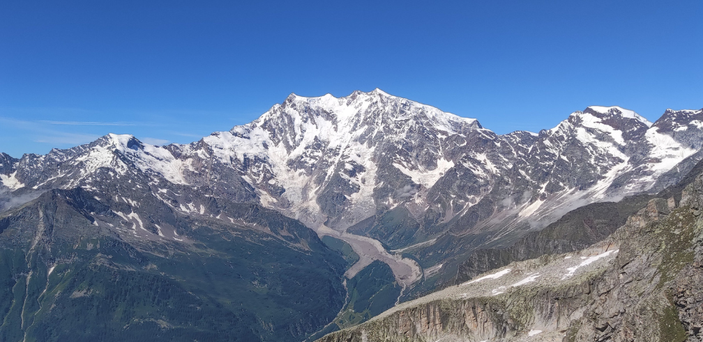

# The Belvedere Glacier Handbook

Welcome to the **Belvedere Glacier Handbook**. This guide is designed to help visitors effectively explore the data and tools developed as part of the long-term monitoring program of the Belvedere Glacier, located in the Italian Alps.

The monitoring program brings together cutting-edge geospatial technologies, interactive platforms, and open-access resources to document and analyze the glacier's evolution over time. The primary goal is to facilitate access to scientific data, promote awareness of climate change impacts, and encourage collaboration between researchers, students, and the general public.

In this handbook, you will find step-by-step instructions on how to:

* Navigate the interactive 3D Viewer for exploring glacier surface changes.
* Access and visualize historical point cloud data and annual GNSS measurements.
* Analyze time series trends and compare datasets across different years.
* Utilize the available tools for research, education, and public outreach.

Whether you are a researcher interested in glacier dynamics, a student exploring geospatial tools, or a curious visitor eager to learn more about environmental change, this handbook will guide you in making the most of the data and platforms provided.

By following this guide, you will gain a deeper understanding of the glacier’s evolution and the importance of long-term monitoring efforts in the context of climate change.