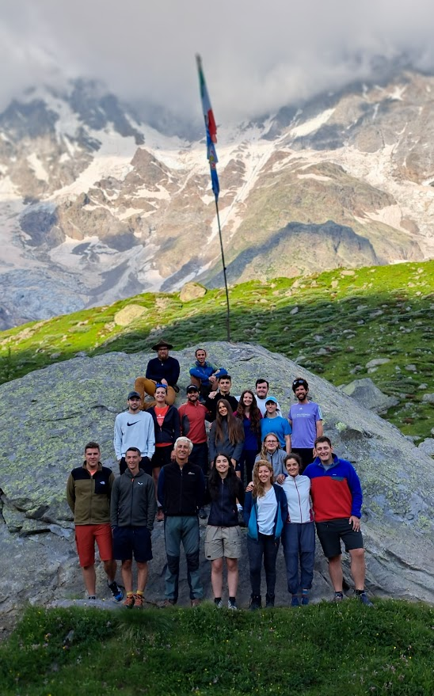

# Learning resources

As part of the long-term research and monitoring program on the Belvedere Glacier, the Geodesy and Geomatics Section of the Department of Civil and Environmental Engineering (DICA) at Politecnico di Milano hosts an annual **week-long Summer School**. This initiative introduces students to the fundamentals of geomatics surveying in challenging, real-world settings. The innovative course, titled “**Design and Implementation of Topographic Surveys for Territorial Monitoring in Mountain Environments**,” is designed for undergraduate and graduate students in Civil and Environmental Engineering, Geoinformatics, and Architecture at Politecnico di Milano. The Summer School’s primary goal is to provide *hands-on experience in topographic monitoring* within mountain environments—an essential skill typically covered only in theoretical classes with limited practical application, often confined to controlled educational settings rather than real-world scenarios.

*Group picture from the 2024 edition of the Belvedere Summer School*

The teaching material used during the summer school is openly accessible and released online through a GitHub Pages - MkDocs website: https://labmgf-polimi.github.io/belvedere-summer-school/

Each module covers essential concepts of GNSS survey, photogrammetry and GIS processing, providing both theoretical and practical concepts. In particular, with the course material you will have an understanding of the software Metashape, CloudCompare and QGIS.

## Course contents

* **[Introduction](https://tars4815.github.io/belvedere-summer-school/introduction/)**: This module gives a brief introduction to the course, providing a general overview of the summer school and the main topics covered during the course.

* **[Module 1](https://tars4815.github.io/belvedere-summer-school/module1/module1/)**: this module describes the monitoring activity carried out on the Belvedere Glacier with UAV photogrammetry and GNSS.

* **[Module 2](https://tars4815.github.io/belvedere-summer-school/module2/module2/)**: this module give an introduction to photogrammetry.

* **[Module 3](https://tars4815.github.io/belvedere-summer-school/module3/module3/)**: this module gives an introduction to GNSS positioning.

* **[Module 4](https://tars4815.github.io/belvedere-summer-school/module4/module4/)**: this module gives an introduction to GIS and spatial data analysis.

* **[Module 5](https://tars4815.github.io/belvedere-summer-school/module5/module5/)**: this module gives an introduction on the stereo processing from fixed-time-lapse cameras.

*   **[Module 6](https://tars4815.github.io/belvedere-summer-school/module6/module6/)**: this module is dedicated to the learning of HTML, CSS and JS basics to implemente a Potree viewer for visualising pointclouds on the web.

## Contacts

* Project responsible and supervisor: Livio Pinto, Full Professor at DICA - PoliMi (livio.pinto@polimi.it)

* Reference persons for learning resources: Federica Gaspari, PhD Student at DICA - PoliMi (federica.gaspari@polimi.it), Francesco Ioli, PostDoc at UZH (francesco.ioli@polimi.it)
