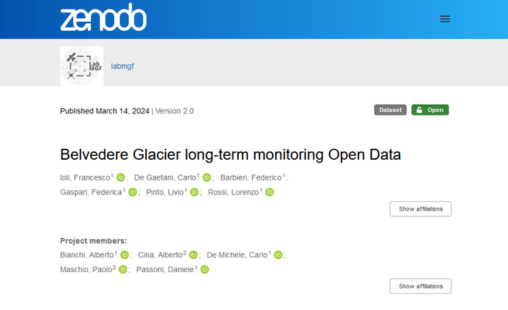

# Website

**The Belvedere Glacier** website offers information on the monitoring and study of the debris-covered Belvedere Glacier in the Italian Alps. It provides access to open geodata, including point clouds, digital surface models, and orthophotos from 1977-2023, along with GNSS measurement data. Users can explore a 3D viewer of the glacier and learn about the annual summer school program organized by the Politecnico di Milano. You can visit the website at this link: [https://thebelvedereglacier.it/](https://thebelvedereglacier.it/)

The website is the starting point to get to know more interactively about the Belvedere glacier conditions over time. You can find 4 main sections:
* **3D Viewer**
* **Open geodata**
* **Measurement data**
* **Summer School**

Each of the sections 

## 3D Viewer 

The tool, based on open source libraries, allows for easy and interactive exploration of 3D products, in particular point clouds, in space and time. 

**[Exploration Guide >>](3d-viewer.md)**

## Open Geodata

[...]

**[Exploration Guide >>](glacier-open-data.md)**

## Measurement data

[...]

**[Exploration Guide >>](2d-map-explorer.md)**

## Summer School

[...]

**[Open Learning Resources >>](learning-resources.md)**